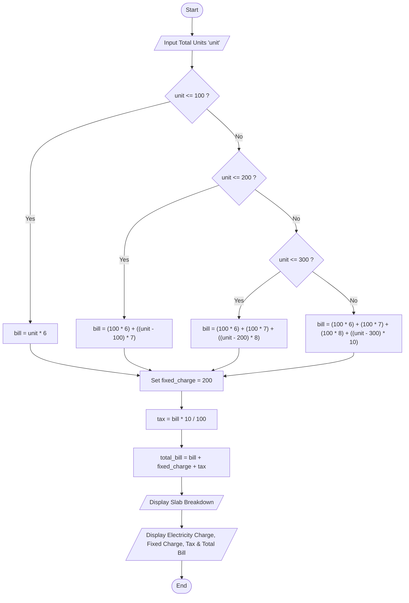

# Electricity Bill Calculator

## Project Title

Electricity Bill Calculator

---

## Problem Statement

Write a Python program to calculate the electricity bill based on the number of units consumed.

The program will take the total electricity units from the user and calculate the bill using the slab-wise rate system. After calculating the electricity charge, it will add a fixed charge and tax to generate the final electricity bill.

---

## Objective

The objective of this project is to learn the basic concepts of Python programming such as:

- Variables
- Input and Output
- Arithmetic Operators
- Comparison Operators
- Conditional Statements (if, elif, else)

---

## Input

The program will ask the user to enter:

- Total Units Consumed

Example:

```
Enter Total Units : 450
```

---

## Slab Rate

| Units | Rate |
|-------|------|
| 1 - 100 | ₹6 per unit |
| 101 - 200 | ₹7 per unit |
| 201 - 300 | ₹8 per unit |
| Above 300 | ₹10 per unit |

---

## Additional Charges

- Fixed Charge = ₹200
- Tax = 10% of Electricity Charge

---

## Processing

The program will:

- Read total units from the user.
- Calculate the electricity charge according to slab rates.
- Add Fixed Charge.
- Calculate 10% Tax.
- Display the Final Electricity Bill.

---

## Flowchart



---

## Algorithm

1. **Start**
2. Display the application header (`"--------- ELECTRICITY BILL CALCULATOR ---------"`).
3. Prompt the user to input the total units consumed (`unit`) as an integer.
4. Calculate the base electricity charge (`bill`) based on slab rates:
   - **If** `unit <= 100`:
     - `bill = unit * 6`
   - **Else if** `unit <= 200`:
     - `bill = (100 * 6) + ((unit - 100) * 7)`
   - **Else if** `unit <= 300`:
     - `bill = (100 * 6) + (100 * 7) + ((unit - 200) * 8)`
   - **Else** (`unit > 300`):
     - `bill = (100 * 6) + (100 * 7) + (100 * 8) + ((unit - 300) * 10)`
5. Set `fixed_charge = 200`.
6. Calculate tax: `tax = bill * 10 / 100` (10% of electricity charge).
7. Calculate total bill: `total_bill = bill + fixed_charge + tax`.
8. Display the bill header and the units consumed.
9. Display the slab-wise calculation breakdown:
   - If `unit <= 100`: print charges for units 1–100.
   - If `unit <= 200`: print charges for units 1–100 and 101–200.
   - If `unit <= 300`: print charges for units 1–100, 101–200, and 201–300.
   - If `unit > 300`: print charges for units 1–100, 101–200, 201–300, and 301+.
10. Display Electricity Charge, Fixed Charge, Tax (10%), and Total Bill.
11. **Stop**

---

## Output

Example Output

```
--------- ELECTRICITY BILL ---------

Units Consumed : 450

1 - 100 Per Unit ₹6 = 600
101 - 200 Per Unit ₹7 = 700
201 - 300 Per Unit ₹8 = 800
301 - Above Per Unit ₹10 = 1500

Electricity Charge : ₹3600
Fixed Charge : ₹200
Tax (10%) : ₹360
Total Bill : ₹4160
```

---

## Formula Used

Electricity Charge

```
Calculated according to slab rates.
```

Tax

```
Tax = Electricity Charge × 10 / 100
```

Final Bill

```
Total Bill = Electricity Charge + Fixed Charge + Tax
```

---

## Concepts Used

- Variables
- Input Function
- Output Function
- Arithmetic Operators
- Comparison Operators
- Conditional Statements (if, elif, else)

---

## Language

Python

---

## Developed By

Name : Mozahidur Rahaman

Roll No : 25103070025

Registration No. 25103003150 of 2025-2026

Department : B.Tech CSE
